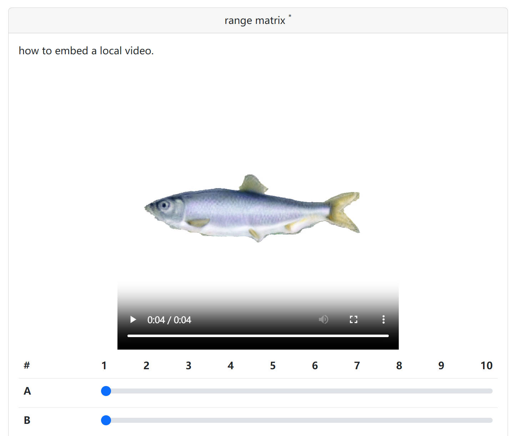

# q10r

This is a fork of [q10r](https://github.com/vlevit/q10r) modified to support embedding videos.

> q10r is a simple questionnaire web app based on Flask. 
It produces questionnaires from JSON files and stores submissions in JSON files under different directory. 
q10r also provides a page for viewing questionnaire results.



## Installation

```bash
pip install -r requirements.txt
```

## Usage

### Make a questionnaire

Create a JSON file under `questionnaires`, follow the `example.json` to config your questionnaire.

Supported type of questions:
* string
* text
* checkbox
* radio
* matrix

To embed a video, you could use either a public website link, or a path to a local video in `static`.

### Deploy

```bash
# debug mode in local environment
python app.py --port=5000

# serve with waitress
waitress-serve --threads=32 --port=5000 app:app
```

Hosted pages:
* All available questionnaires, admin login required (http://localhost:5000)
* Questionnaire, publicly available (http://localhost:5000/example)
* Results, admin login required (http://localhost:5000/example/results)

The admin login username and password can be set in `config.py`, with the default as:
```
username: kiui
password: tmp1234
```


Use a server with static IP to access it from public:
```
http://<IP>:5000
```

Otherwise, use tools like [frp](https://github.com/fatedier/frp) to forward the local port to a server with a static IP:

On local machine, run `frpc -c frpc.ini`:
```
[common]
server_addr = <IP>
server_port = 7000
token = <auth token>

[web]
type = http
local_ip = 0.0.0.0
local_port = 5000
custom_domains = <IP>
```

On remote server with static IP, run `frps -c frps.ini`:
```
[common]
bind_port = 7000
bind_udp_port = 7000
vhost_http_port = 7001
token = <auth token>
```

then you can access it from
```
http://<IP>:7001
```